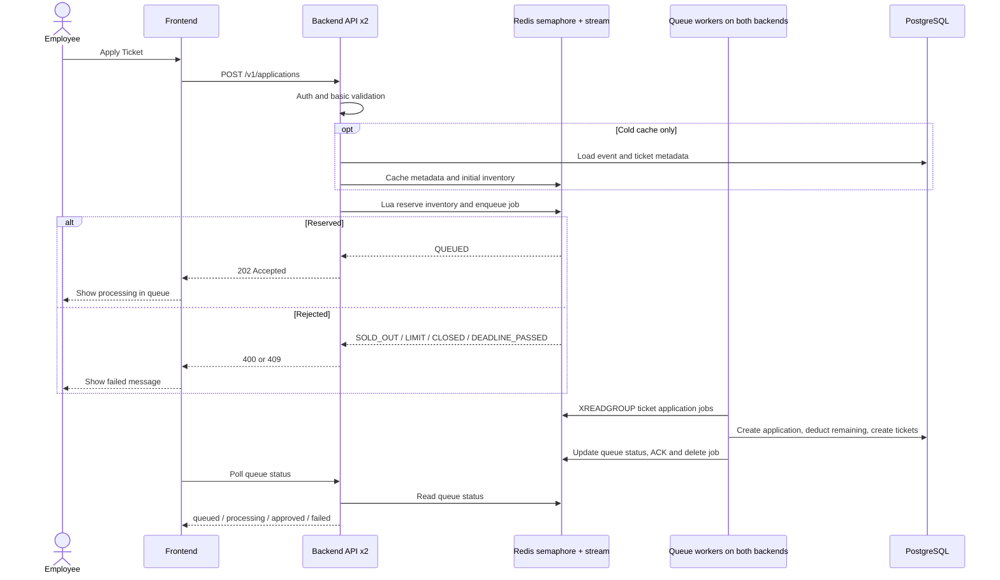
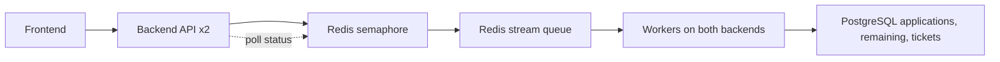

# Redis Queue Semaphore Load Test Notes

這份文件整理本次把搶票流程改成 Redis queue-based semaphore 後的壓測方式、shard 的意義、雙後端單資料庫拓樸下的測試結果，以及目前新版 sequence diagram。

## 1. Shard 數量控制什麼

這裡的 shard 是 **load generator shard**，不是 backend shard、不是 Redis partition，也不是 queue partition。

在測試時，每個 shard 是一個獨立的 k6 container，負責一部分 VUs。舉例：

```text
Total VUs = 20000
2 backend
10 shards

=> 每個 backend 吃 5 個 shard
=> 每個 shard 跑 2000 VUs
=> 每個 backend 約吃 10000 VUs
```

調整 shard 數量主要是在控制這些事情：

1. **單一 k6 container 的記憶體與初始化壓力**
   - 單一 k6 container 跑太多 VUs 時，會先遇到 k6/Docker Desktop 的限制。
   - 例如單 container 跑 12000 VUs 曾經在初始化到約 6000 多 VUs 時被 kill，exit code 137。

2. **是否能平均分流到兩個 backend**
   - 雙後端測試時，我把一半 shard 打到 `backend:8001`，另一半打到 `ts_backend_2:8001`。
   - 這比單一入口更容易明確控制兩個 backend 的流量比例。

3. **降低 load generator 本身成為瓶頸的機率**
   - 20000 VUs 第一次用 6 shards 時，所有 k6 container 都出現 `error waiting for container: unexpected EOF`。
   - 同樣 20000 VUs 改成 10 shards，每個 shard 只跑 2000 VUs 後，成功率回到 100%。

4. **副作用：太多 shard 也會增加 Docker Desktop 壓力**
   - shard 不是越多越好。
   - 32000 VUs 用 16 shards 時，所有 shard 都回報 Docker `unexpected EOF`，同時部分 shard summary missing。
   - 因此 32000 那輪不能單純視為 backend 回錯誤，而比較像本地壓測器/Docker 層也到極限。

簡單講：

```text
shard 數量 = 把總 VU 拆成幾個 k6 container 來送
```

它會影響 k6/Docker 的穩定性、每個 backend 的流量分配，以及測試結果是否被 load generator 自己污染。

## 2. 測試拓樸

最後採用的有效測試拓樸是：

```text
k6 shard containers
  -> backend:8001
  -> ts_backend_2:8001

backend + ts_backend_2
  -> same Redis
  -> same PostgreSQL
```

也就是：

- 2 個 backend instance
- 1 個 PostgreSQL
- 1 個 Redis
- 同一條 Redis stream：`ticket:applications`
- 同一個 consumer group：`ticket-workers`
- 每輪測試都讓 `TOTAL_QUOTA = TOTAL_USERS = VUS`，避免測到票不夠
- 每個 user 只送 1 次申請，`MAX_TICKETS_PER_PERSON=1`

## 3. 測試前準備

### 3.1 確認 queue 模式與 worker 設定

本次 backend 以 queue 模式啟動：

```powershell
$env:TICKET_QUEUE_ENABLED = 'true'
$env:TICKET_QUEUE_MAX_WAITING = '100000'
$env:TICKET_QUEUE_WORKERS = '16'
docker compose up -d --build backend
```

確認 backend 環境：

```powershell
docker inspect ts_backend --format '{{range .Config.Env}}{{println .}}{{end}}' |
  Select-String -Pattern 'TICKET_QUEUE|DB_MAX|PORT'
```

當時主要設定：

```text
TICKET_QUEUE_ENABLED=true
TICKET_QUEUE_STREAM=ticket:applications
TICKET_QUEUE_GROUP=ticket-workers
TICKET_QUEUE_WORKERS=16
TICKET_QUEUE_MAX_WAITING=100000
DB_MAX_OPEN_CONNS=200
DB_MAX_IDLE_CONNS=50
PORT=8001
```

### 3.2 拉 k6 Docker image

一開始用 Windows host 上的 k6 打 `localhost:8001`，1000 VUs 就遇到大量 connection refused。後來改成讓 k6 container 跑在 Docker network 裡，直接打 backend service name。

```powershell
docker pull grafana/k6:latest
```

確認 compose network：

```powershell
docker inspect ts_backend --format '{{range $name, $_ := .NetworkSettings.Networks}}{{$name}}{{end}}'
```

當時 network 是：

```text
corporate-event-ticketing-system-team13_default
```

## 4. 啟動第二個 backend instance

為了模擬「兩個後端 + 一個資料庫」，保留 compose 內原本的 `ts_backend`，另外手動起一個相同 image 的 `ts_backend_2`。

`ts_backend_2` 不綁 host port，只放進同一個 Docker network，讓 k6 從 network 內部打：

```powershell
docker run --rm -d `
  --name ts_backend_2 `
  --network corporate-event-ticketing-system-team13_default `
  -e MINIO_PUBLIC_ENDPOINT=http://localhost:9000 `
  -e TICKET_QUEUE_GROUP=ticket-workers `
  -e MINIO_ENDPOINT=minio:9000 `
  -e TICKET_QUEUE_ENABLED=true `
  -e MINIO_BUCKET_NAME=ticketing-attachments `
  -e DB_CONN_MAX_LIFETIME_MINUTES=30 `
  -e DB_MAX_IDLE_CONNS=50 `
  -e TICKET_QUEUE_RESERVATION_TTL_SECONDS=900 `
  -e PORT=8001 `
  -e DB_MAX_OPEN_CONNS=200 `
  -e TICKET_QUEUE_MAX_WAITING=100000 `
  -e ALLOWED_ORIGINS=http://localhost:5173,http://localhost:3000,http://localhost:8080 `
  -e MINIO_SECRET_KEY=minioadmin `
  -e JWT_SECRET=dev-jwt-secret-change-in-prod-32chars!! `
  -e TICKET_QUEUE_STREAM=ticket:applications `
  -e TEST_USER_PASSWORD=password `
  -e DATABASE_URL='host=postgres user=ts_user password=ts_password dbname=ticketing_system port=5432 sslmode=disable' `
  -e TICKET_QUEUE_STATUS_TTL_SECONDS=3600 `
  -e TICKET_QUEUE_WORKERS=16 `
  -e REDIS_URL=redis://redis:6379 `
  -e MINIO_ACCESS_KEY=minioadmin `
  -e EVENT_LIST_CACHE_TTL_SECONDS=5 `
  corporate-event-ticketing-system-team13-backend
```

確認第二個 backend：

```powershell
docker ps --filter name=ts_backend_2 --format '{{.Names}} {{.Status}} {{.Networks}}'
docker logs --tail 50 ts_backend_2
docker run --rm --network corporate-event-ticketing-system-team13_default curlimages/curl:latest -fsS http://ts_backend_2:8001/health
```

測完後停止：

```powershell
docker stop ts_backend_2
```

因為 `docker run` 有加 `--rm`，停止後容器會被移除。

## 5. 每輪測試資料準備

每輪都重新產生一組 event、ticket type、users。

PowerShell variables：

```powershell
$Node = 'C:\Users\lin\.cache\codex-runtimes\codex-primary-runtime\dependencies\node\bin\node.exe'
$Total = 28000
$RunId = 'codex-two-backend-' + $Total + '-' + (Get-Date -Format 'yyyyMMdd-HHmmss')
$ResultDir = "load-test/results/$RunId"

New-Item -ItemType Directory -Force -Path $ResultDir | Out-Null

$env:RUN_ID = $RunId
$env:TOTAL_USERS = [string]$Total
$env:TOTAL_QUOTA = [string]$Total
$env:MAX_TICKETS_PER_PERSON = '1'
```

產生資料：

```powershell
& $Node load-test/generate_data.js | Tee-Object -FilePath "$ResultDir/generate-data.log"
Copy-Item load-test/setup_db.sql "$ResultDir/setup_db.sql" -Force
Copy-Item load-test/stress_env.json "$ResultDir/stress_env.json" -Force
```

匯入 PostgreSQL：

```powershell
Get-Content load-test/setup_db.sql |
  docker exec -i ts_postgres psql -q -U ts_user -d ticketing_system |
  Tee-Object -FilePath "$ResultDir/db-insert.log"
```

清掉 Redis stream：

```powershell
docker exec ts_redis redis-cli DEL ticket:applications
Start-Sleep -Seconds 1
```

注意：刪 stream 也會刪掉 consumer group。本次程式已補 `NOGROUP` handling，worker 看到 group 不存在時會重新建立 group。

## 6. k6 sharded 執行方式

### 6.1 分流規則

雙後端測試時，shards 平均打到兩個 backend：

```text
backend #1: http://backend:8001/v1
backend #2: http://ts_backend_2:8001/v1
```

例如：

```text
28000 VUs
14 shards
2 backend

=> 每個 shard 2000 VUs
=> backend #1: 7 shards = 14000 VUs
=> backend #2: 7 shards = 14000 VUs
```

### 6.2 單一 shard 的 k6 指令

每個 shard 都會有自己的資料夾，裡面放：

```text
book-ticket.js
stress_env.json
endpoint.txt
k6.out.log
k6.err.log
book-summary.json
```

單一 shard 的等價指令如下：

```powershell
docker run --rm `
  --network corporate-event-ticketing-system-team13_default `
  -v "${FullShardDir}:/scripts" `
  -w /scripts `
  -e "BASE_URL=$Endpoint" `
  -e "VUS=$Count" `
  -e ITERATIONS=1 `
  -e MAX_DURATION=5m `
  -e STRICT_THRESHOLDS=0 `
  -e ERROR_SAMPLE_RATE=0.001 `
  -e DISCARD_RESPONSE_BODIES=1 `
  -e HTTP_TIMEOUT=30s `
  grafana/k6:latest `
  run `
  --compatibility-mode=base `
  --summary-export /scripts/book-summary.json `
  book-ticket.js
```

其中：

- `$Endpoint` 是 `http://backend:8001/v1` 或 `http://ts_backend_2:8001/v1`
- `$Count` 是這個 shard 要跑的 VU 數
- `--compatibility-mode=base` 用來降低 k6 runtime 負擔
- `DISCARD_RESPONSE_BODIES=1` 用來降低 response body 記憶體壓力
- `HTTP_TIMEOUT=30s` 是本次測試的 client timeout

### 6.3 同時啟動多個 shard

實際上是用 PowerShell `Start-Process` 同時啟動多個 k6 container：

```powershell
$Proc = Start-Process `
  -FilePath 'docker' `
  -ArgumentList $ArgList `
  -NoNewWindow `
  -PassThru `
  -RedirectStandardOutput (Join-Path $ShardDir 'k6.out.log') `
  -RedirectStandardError (Join-Path $ShardDir 'k6.err.log')

$Procs += $Proc

$Procs | Wait-Process
```

每個 shard 結束後記錄 exit code：

```powershell
$ExitSummary = @()
for ($i = 0; $i -lt $Procs.Count; $i++) {
  $ExitSummary += "shard$($i+1)=$($Procs[$i].ExitCode)"
}
$ExitSummary | Tee-Object -FilePath "$ResultDir/k6-exit-code.txt"
```

## 7. 每輪測試後驗證

等待 worker drain：

```powershell
$deadline = (Get-Date).AddSeconds(780)
do {
  $stream = (docker exec ts_redis redis-cli XLEN ticket:applications).Trim()
  $pendingRaw = (docker exec ts_redis redis-cli XPENDING ticket:applications ticket-workers) -join ' '
  $tickets = (docker exec ts_postgres psql -q -U ts_user -d ticketing_system -t -A -c "SELECT COUNT(*) FROM tickets WHERE event_id = '$EventId';").Trim()

  if ($stream -eq '0' -and $pendingRaw.Trim().StartsWith('0') -and $tickets -eq [string]$Total) {
    break
  }

  Start-Sleep -Seconds 2
} while ((Get-Date) -lt $deadline)
```

DB summary：

```powershell
docker exec ts_postgres psql -q -U ts_user -d ticketing_system -t -A -F '=' -c "
SELECT 'applications_count', COUNT(*) FROM applications WHERE event_id = '$EventId'
UNION ALL SELECT 'tickets_count', COUNT(*) FROM tickets WHERE event_id = '$EventId'
UNION ALL SELECT 'approved_applications_count', COUNT(*) FROM applications WHERE event_id = '$EventId' AND status = 'approved'
UNION ALL SELECT 'pending_applications_count', COUNT(*) FROM applications WHERE event_id = '$EventId' AND status = 'pending'
UNION ALL SELECT 'ticket_type_total_quota', total_quota FROM ticket_types WHERE id = '$TicketTypeId'
UNION ALL SELECT 'ticket_type_remaining', remaining FROM ticket_types WHERE id = '$TicketTypeId';
"
```

Redis summary：

```powershell
docker exec ts_redis redis-cli GET "inventory:$TicketTypeId"
docker exec ts_redis redis-cli XLEN ticket:applications
docker exec ts_redis redis-cli XPENDING ticket:applications ticket-workers
```

k6 summary aggregation：

```powershell
$TotalReqs = 0
$TotalSuccess = 0
$TotalQueued = 0

for ($i = 1; $i -le $TotalShards; $i++) {
  $SummaryPath = Join-Path $ShardRoot "shard$i/book-summary.json"
  if (Test-Path $SummaryPath) {
    $S = Get-Content $SummaryPath -Raw | ConvertFrom-Json
    $Reqs = [int]$S.metrics.http_reqs.count
    $Succ = [int]$S.metrics.booking_success.count
    $Queued = [int]$S.metrics.booking_queued_202.count

    $TotalReqs += $Reqs
    $TotalSuccess += $Succ
    $TotalQueued += $Queued
  }
}

$SuccessRate = if ($TotalReqs -gt 0) {
  [Math]::Round(($TotalSuccess / $TotalReqs) * 100, 4)
} else {
  0
}
```

## 8. 測試結果摘要

以下是雙後端單資料庫拓樸下的有效結果：

```text
VUs     Success rate   DB tickets   Redis inventory   Max shard p95
4000    100%           4000         0                 582ms
8000    100%           8000         0                 1000ms
12000   100%           12000        0                 1293ms
16000   100%           16000        0                 842ms
20000   100%           20000        0                 4037ms
24000   100%           24000        0                 5351ms
28000   100%           28000        0                 2727ms
32000   <100%          26404        5596              ~33s
```

### 8.1 20000 VUs 的補充

20000 VUs 第一次用 6 shards 時出現：

```text
error waiting for container: unexpected EOF
```

那輪結果不穩。改成 10 shards、每 shard 2000 VUs 後：

```text
total_reqs=20000
total_success=20000
success_rate_percent=100
applications_count=20000
tickets_count=20000
redis_inventory=0
redis_stream_length=0
redis_stream_pending=0
```

所以 20000 VUs 判定為通過。

### 8.2 32000 VUs 的判讀

32000 VUs 是第一個低於 100% 的測試點，但失敗型態不是 backend 明確回 5xx：

```text
backend restart = 0
backend OOM = false
server_errors = 0
PostgreSQL still running
Redis stream length = 0
Redis pending = 0
```

k6 看到大量：

```text
http_req_failed
error waiting for container: unexpected EOF
```

DB 最後仍成功落了：

```text
applications_count=26404
tickets_count=26404
redis_inventory=5596
```

這代表：

- 沒有 oversell
- Redis semaphore 的剩餘票數是合理的：`32000 - 26404 = 5596`
- 失敗主要表現為 client/load-generator timeout 或 Docker Desktop 層中斷
- 本地環境下可以保守說穩定上限至少是 28000 VUs；32000 VUs 開始出現 client-side / load-generator-side failure

## 9. 粗略版 Sequence Diagram

這張圖只畫主流程，避免把每個 Redis key、初始化鎖、DB transaction 細節都塞進去。它和實作比較接近的幾個重點是：

- `TicketService` 是 backend 裡的 service，不是獨立 process。
- 兩個 backend 都可以接 API request，也都可以跑 queue worker。
- request hot path 主要打 Redis，不再每次先去 PostgreSQL 查剩餘票數。
- Redis 負責 semaphore reservation 和 stream enqueue。
- PostgreSQL 在 worker 階段負責最終落庫；同一個 transaction 會建立 application、扣 `ticket_types.remaining`、建立 tickets。
- frontend polling 還是經過 backend，再由 backend 讀 Redis queue status。



如果要再更粗，可以把它縮成這個四段式：



## 10. 文字版流程

### Request hot path

1. 使用者按下 Apply Ticket。
2. Frontend 打 `POST /v1/applications`。
3. 任一 backend 驗 JWT / role。
4. TicketService 先看 Redis status key：
   - 如果同 idempotency key 已經存在，直接回現有 queue state。
   - 如果不存在，進入 Redis reservation。
5. TicketService 確認 Redis inventory/meta 是否已載入：
   - cold cache 時，只有拿到 `init_lock` 的 backend 會去 PostgreSQL 載 event + ticket type metadata。
   - 其他 backend 等 Redis metadata 載入。
6. Redis Lua script 原子處理：
   - event 是否 published
   - apply deadline 是否過期
   - ticket type 是否屬於 event
   - 使用者此 event 的 Redis reservation 是否超過上限
   - inventory 是否足夠
   - 扣 Redis inventory
   - 寫 queue status
   - XADD job 到 stream
7. 成功就回 `202 Accepted`，前端顯示排隊中。
8. 不成功就回 `400/409`，前端顯示沒搶到票或票券不足等訊息。

### Worker path

1. 兩個 backend 的 workers 都用同一個 Redis consumer group 讀 `ticket:applications`。
2. Worker 拿到 job 後把 status 改成 `processing`。
3. Worker 開 PostgreSQL transaction。
4. 用 `pg_advisory_xact_lock(user,event)` 避免同一使用者同一活動重複落庫競爭。
5. Worker 做 DB 防線驗證：
   - event 仍存在且 published
   - deadline 尚未過
   - ticket type 屬於 event
   - DB 中此 user/event 的已發票與 pending 數沒有超過限制
6. 同一個 transaction 內建立 application、扣 `ticket_types.remaining`、建立 ticket rows。
7. 成功後：
   - 釋放 Redis per-user reservation
   - queue status 改成 `approved`
   - `XACK`
   - `XDEL`
8. 失敗後：
   - return Redis inventory
   - release per-user reservation
   - queue status 改成 `failed`
   - `XACK`
   - `XDEL`

## 11. 目前仍要注意的點

1. queue 模式下有兩個庫存視角。
   - hot path 的可售判斷以 Redis inventory 為準，避免所有 request 先打 PostgreSQL 搶同一列。
   - worker 成功落庫時會同步扣 `ticket_types.remaining`，所以 DB remaining 應該在 worker drain 完後和 Redis inventory 對齊。
   - 如果壓測後看到 Redis inventory 是 `0` 但 DB remaining 沒扣，通常代表 backend container 還是舊 image，需要 rebuild/restart 後再測。

2. 32000 VUs 看到的第一個非 100% 主要是 client timeout / Docker EOF。
   - 本地 Docker Desktop 不一定能代表正式環境。
   - 若要找真正服務端極限，建議在 k8s 或多台 load generator 上測。

3. request hot path 已經避免每次打 PostgreSQL 查庫存。
   - 但 cold cache 初始化仍會查 PostgreSQL 一次。
   - worker 最終落庫仍會受 PostgreSQL transaction、扣 DB remaining、insert applications/tickets 的 throughput 影響。

4. worker 失敗時會把 Redis reservation 補回。
   - 如果 DB transaction 失敗，流程會 return Redis inventory、釋放 per-user reservation，並把 queue status 改成 `failed`。
   - 如果 worker 卡住或容器中斷，仍需要靠 pending/stream 監控或人工 reconciliation 確認是否有未處理 job。
